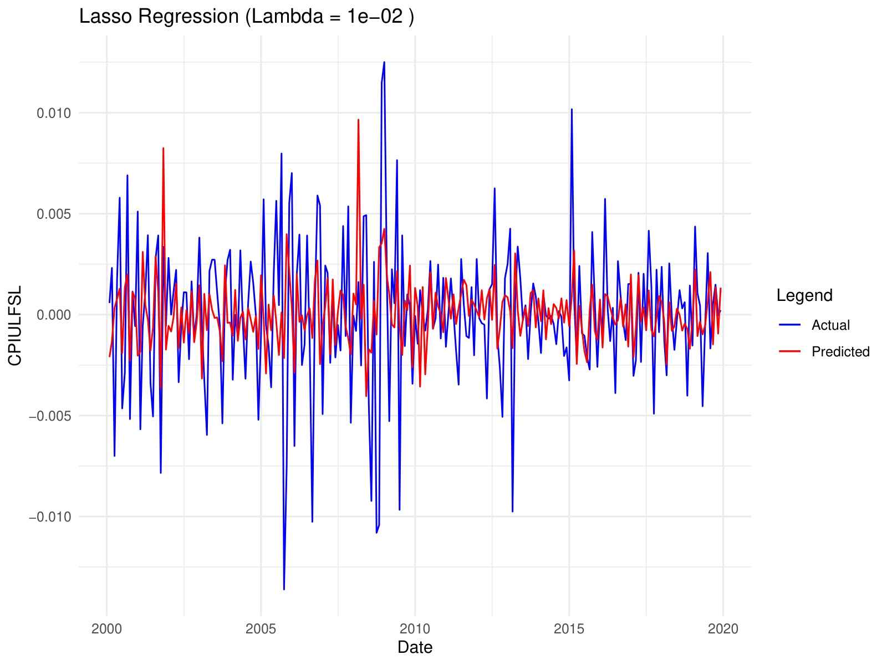

# Inflation Forecasting with ML

This updated university group project, completed during my Bachelor's in Economics at the University of Bologna, focuses on forecasting inflation using various time series and ML techniques. The dataset, FRED-MD, is provided by the Federal Reserve Bank of St. Louis, a trusted authority in macroeconomic data.

## Methodology

I used a mix of traditional econometric models and modern machine learning techniques to forecast inflation. These include:

- **AR(1) Model**: A baseline autoregressive model for inflation trends.
- **Lasso, Ridge and Elastic Net**: Regularization techniques to handle the curse of dimensionality.
- **Principal Component Regression (PCR)**: Dimensionality reduction for large datasets.
- **Vector Autoregression (VAR)**: Captures relationships between inflation and other macroeconomic indicators.
- **Random Forest (RF)**: Models non-linear patterns in the data.

## Files

**`pre_processing.R`** Prepares the dataset, handles missing values, checks stationarity, and visualizes time series.

**`ar_1.R`** Implements the AR(1) model as a benchmark.

**`lasso.R`** Fits a Lasso regression model with tuned regularization parameters.

**`ridge.R`** Applies Ridge regression following the same logic.

**`elastic_net.R`** Combines L1 and L2 regularization.

**`pcr.R`** Performs Principal Component Regression, optimizing the number of principal components.

**`var.R`** Fits VAR models, optionally using PCA pre-processing.

**`random_forest.R`** Uses Random Forest to experiment with a non linear method.

**`presentation.pdf`** Set of slides explaining the methodology, results, and model comparisons.

**`user_guide.pdf`** A short guide on running the scripts, modifying parameters, etc.

**`current.csv`** Contains US monthly macroeconomic indicators from the Federal Reserve.


## Results Example

Below is a visualization of the Lasso Regression results from the analysis. For further details and insights, please refer to the presentation slides.




## User Guide

A detailed user guide is available in `user_guide.pdf` for more information. The process is anyway very straightforward.

1. **Setup**:
   - Clone the repository (Recommended):  
     ```bash
     git clone https://github.com/Alessandro-Dodon/inflation_forecast  
     cd inflation_forecast  
     ```
   - Download as ZIP (Alternative):  
     Click the **"Code"** button (green) at the top of the repository page, select **"Download ZIP"**, extract the files, and place them in your working directory.  
   - Make sure to keep `current.csv` in the same directory as the scripts (a relative path is used).  
   - If you prefer, download the monthly dataset `current.csv` from the [FRED-MD website](https://www.stlouisfed.org/research/economists/mccracken/fred-databases).
   - Ensure R is installed.

2. **Execution**:
   - Start by running `pre_processing.R`, as all other scripts depend on the preprocessed data.
   - Metrics are printed in the console, and plots are saved as PDF files in the same directory.

3. **Packages**:
   - Uncomment the `install.packages()` lines in the scripts to install any missing R packages. The full list of required packages is provided in the `pre_processing.R` script.

## Contact
For any clarifications, questions, or to report issues with the code, feel free to reach out via email at alessandro.dodon@usi.ch. You can also find my LinkedIn link in my GitHub bio.

